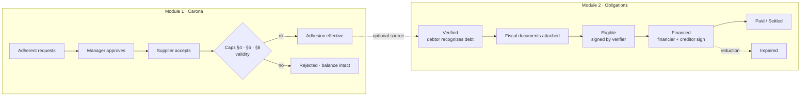

# Solutio

**From public obligation to payment — verifiably.**

Solutio is an open Solana protocol for public procurement obligations. It enforces statutory caps on shared government contracts, starting with Brazil's adhesion limits (Law 14.133/2021, art. 86), and records each government payment obligation through explicit, evidence-backed states. Within the protocol, a cap cannot be exceeded and an obligation's balance cannot be financed twice, even under concurrent requests. Anyone can verify that state on-chain without trusting our interface.

> *Solutio* is the Roman-law term for the extinction of an obligation by payment.

Built for the Colosseum **Crypto World's Fair** hackathon (Solana track).

---

## Status (what is real today)

| Component | Status |
| --- | --- |
| Anchor program (`programs/solutio`) | Implemented, builds for SBF |
| Legal rules as pure functions (`rules.rs`) | Implemented, 11 unit tests incl. 2 randomized suites (2,000 sequences each) |
| Module 1 — Carona (art. 86 caps) | Implemented, 12 integration tests |
| Module 2 — Obligations (single financing) | Implemented, 8 integration tests |
| Integration test environment | LiteSVM (in-process Solana VM running the compiled program) |
| Devnet deployment | **Not yet** |
| Public verifier page | **Not yet** |
| Financing pool (test stablecoin) | **Not started** — experimental, optional |

Last full run: 31 passed, 0 failed (2026-10-09). No real funds, no real government data, no pilot or partnership is claimed.

---

## The problem

Governments are among the largest buyers and slowest payers. Brazilian public procurement averaged **12.5% of GDP in 2006–2016** ([IPEA, TD 2476](https://repositorio.ipea.gov.br/bitstream/11058/9315/2/td_2476_sumex.pdf)). In a December 2025 survey by the National Confederation of Municipalities (CNM), **1,202 of the 4,172 responding municipalities (28.8%)** reported overdue payments to suppliers ([Brasil 61](https://brasil61.com/n/cerca-de-um-terco-das-prefeituras-estao-com-o-pagamento-de-fornecedores-atrasado-bras2515415)).

Two rules decide whether a public claim is sound, and both are hard to verify across institutions today:

1. **Was the contract lawful?** Brazil lets non-participating agencies "ride" (*carona*) on another agency's price-registration record, but caps each rider at 50% of the registered quantity and all riders together at 2x (art. 86, §§4–5). The sum depends on decisions made by independent agencies, often at different levels of government, in systems that do not talk to each other.
2. **Has the claim already been financed?** Financing the same receivable twice is the classic factoring fraud. A lender must confirm the claim is valid, unpaid and not already pledged.

Similar state-run answers exist — Italy's PCC (2012), India's TReDS, Brazil's AntecipaGov (2021). Each runs inside one country's systems, for regulated financiers. Solutio explores a complementary layer: rules and balances that any party can verify, configurable per jurisdiction.

---

## What the program guarantees — and what it does not

**Guaranteed by the program, over its own recorded state:**

- An adhesion becomes effective only with three signatures: the adhering agency (request), the managing agency (approval) and the registered supplier (acceptance).
- No sequence of adhesions, including competing ones, exceeds art. 86 §4 (per agency) or §5 (per item) caps. Statutory exceptions lift §5 but never §4.
- Federal agencies cannot adhere to state, district or municipal records (§8). Expired records accept nothing.
- An obligation is financeable only after a **separate** eligibility confirmation by a designated verifier, backed by attached fiscal documents. Verified (liquidated) ≠ eligible.
- The cumulative financed amount never exceeds the eligible amount. A fiscal document can back only one obligation.
- Financing requires the creditor's signature and evidence that the debtor was notified of the assignment.
- Reductions (withholdings, disallowances) are recorded even when they hurt a financier, and mark the obligation **Impaired** for everyone to see.
- Agency wallets never need SOL: a sponsor pays fees and rent (tested).

**Not guaranteed — depends on off-chain evidence and processes:**

- That a document is authentic, that goods were delivered, or that the debtor will pay.
- That a claim was not assigned *outside* Solutio. The protocol reduces duplication risk; it cannot eliminate operations it does not see.
- Legal eligibility for assignment itself. The program records who confirmed it and the evidence hash; the legal judgment is human.

---

## Architecture



- `src/rules.rs` — every legal and accounting rule as a pure function with no Solana dependency. Handlers only load accounts, call these functions and persist results.
- `src/instructions/carona.rs` — price records, items, adhesion requests and the three-signature flow.
- `src/instructions/obligation.rs` — obligations, fiscal documents, eligibility, financing, reductions, payments.
- `src/events.rs` — every transition emits an event, so history can be rebuilt from the ledger alone.

The legal/documentary layer is separated from the financial act: eligibility and financing are different instructions with different signers.

See [`docs/LEGAL_RULES.md`](docs/LEGAL_RULES.md) for the rule → code → test traceability matrix and [`docs/DECISIONS.md`](docs/DECISIONS.md) for the decision log.

---

## Why Solana

Solana is the shared state between parties with no common operator: agencies at different levels of government, suppliers, financiers and auditors.

- **The program, not a UI, enforces the rules.** A transaction that would breach a cap fails on-chain.
- **Account-level write locking serializes conflicting writes.** Acceptances of the same item, or financings of the same obligation, are processed one after another, and each re-checks current state. See `race_for_the_last_units_only_one_can_win`.
- **Program-derived addresses** let anyone locate a record from public identifiers (price record, item, agency, obligation, document key).
- **Fee-payer separation** lets officials sign without holding SOL (`agency_wallets_sign_without_holding_any_sol`).

Honest caveat: a well-governed shared database run by a single trusted operator could enforce the same rules. Solutio's bet is that, across independent levels of government and competing financiers, nobody is accepted as that operator, and verification must be open to anyone without permission.

---

## Run it

Toolchain used: Rust 1.89 (pinned in `rust-toolchain.toml`), Solana CLI 4.3.0 (Agave), Anchor CLI 1.2.1, platform-tools v1.57.

```bash
# Build the program (SBPF v2: the version supported by the LiteSVM test runtime)
anchor build --no-idl --arch v2

# Unit + integration tests (LiteSVM runs the compiled target/deploy/solutio.so)
cargo test -p solutio
```

---

## Known limitations

- Identity: agencies are registered by a labeled **demo issuer**. Production would use credentials from an accountable authority (e.g. Solana Attestation Service issued by an audit court or state government) and multisig wallets per agency.
- The statutory exception flag (§§6–7) is declared by the managing agency; it is not independently attested yet.
- The 90-day window to execute an approved adhesion is not enforced yet.
- After the debtor's first payment, new financing is closed (simplifying policy for the MVP).
- Open legal interpretation questions are listed in `docs/LEGAL_RULES.md`.

## Research

Solutio is also the artifact of a Design Science Research study on *rules as code* in public procurement: which statutory requirements can be enforced by a program, which require recorded human judgment, and whether shared on-chain state makes compliance more verifiable across institutions.

## License

Apache-2.0. See [LICENSE](LICENSE).
